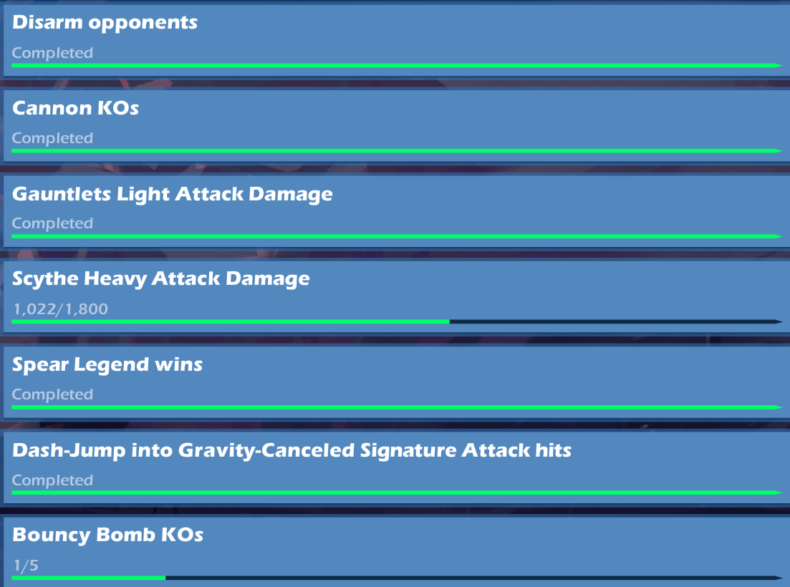

# Brawlhalla Challenge Extractor

The Brawlhalla Challenge Extractor is a desktop application designed to help players identify the best characters to complete specific challenges in the game Brawlhalla. It uses OCR (Optical Character Recognition) to extract challenge descriptions from screenshots and recommends characters based on their abilities to meet these challenges.

## Features

- Extract challenge descriptions from images using OCR.
- Identify the best Brawlhalla characters for completing these challenges.
- User-friendly GUI for easy operation.
- Ability to manually set the path to the Tesseract OCR engine.
- Packaged as an executable for easy distribution and use without needing Python installed.

## Prerequisites

Before you begin, ensure you have met the following requirements:

- Python 3.6 or later is installed on your machine, if you wish to run the script directly.
- Tesseract OCR is installed and accessible in your system's PATH or in the default installation directory. Tesseract OCR can be downloaded from [here](https://github.com/tesseract-ocr/tesseract).

## Installation and Usage

### Running from Source

1. Clone the repository to your local machine:

```bash
git clone https://github.com/yourusername/brawlhalla-challenge-extractor.git
cd brawlhalla-challenge-extractor
```

2. Install the required Python packages:

```bash
pip install -r requirements.txt
```

The `requirements.txt` file should include at least:
- `wxPython`
- `pytesseract`
- `Pillow`
- `opencv-python`
- `ftfy`

3. Ensure Tesseract OCR is correctly installed. If the application does not automatically detect Tesseract OCR, it will prompt you to select the installation directory manually.

4. To start the application, run:

```bash
python main.py
```

### Using the Executable

If you prefer not to run the script directly or do not have Python installed, you can find an executable file in the `dist` folder.

## Usage

After running the application you will be prompted to upload screenshots of the current week's challenges. You **may** upload multiple images at one time.

### Example Challenge Screenshot

Below is an example of a Brawlhalla challenge screenshot that the application can process:



This screenshot demonstrates the kind of image you should upload to the Brawlhalla Challenge Extractor to identify the best characters for completing these challenges.

## Contributing

Contributions to the Brawlhalla Challenge Extractor are welcome. Please ensure to update tests as appropriate.

## License

This project is licensed under the [MIT License](LICENSE).